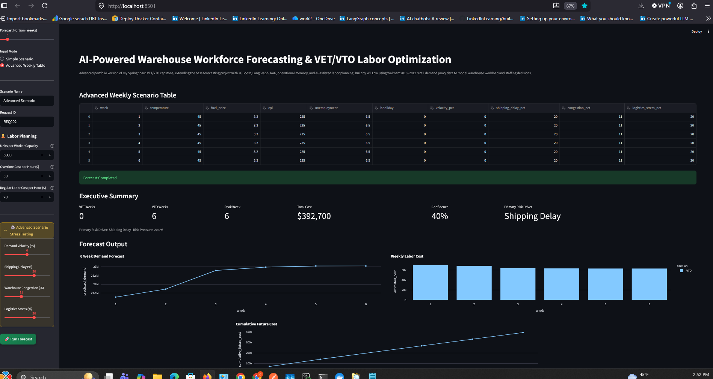
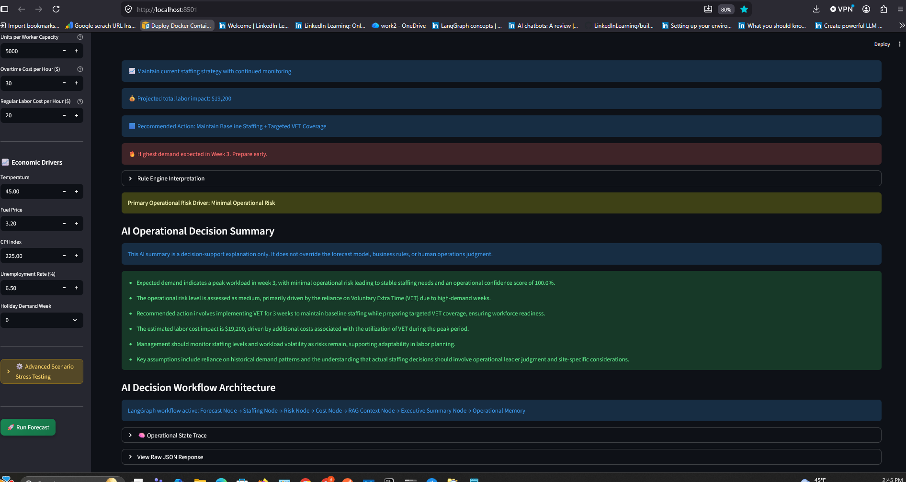
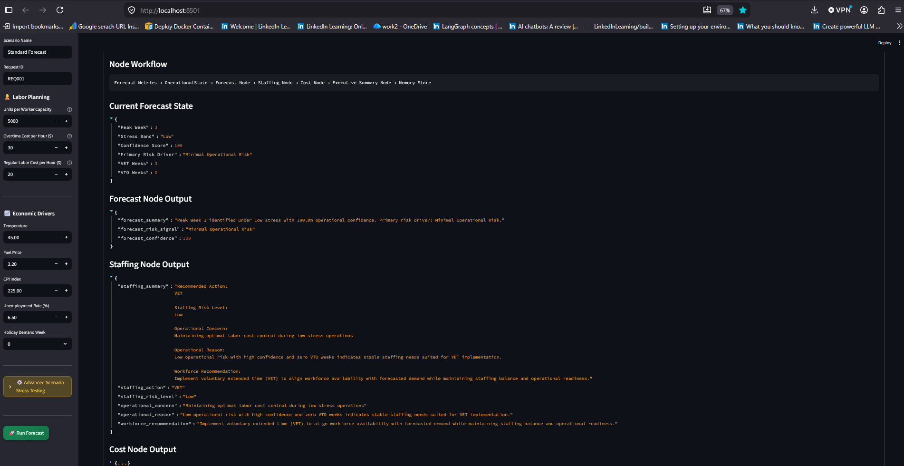
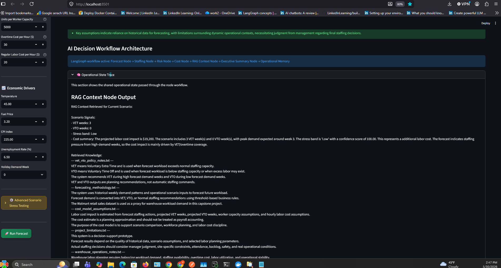
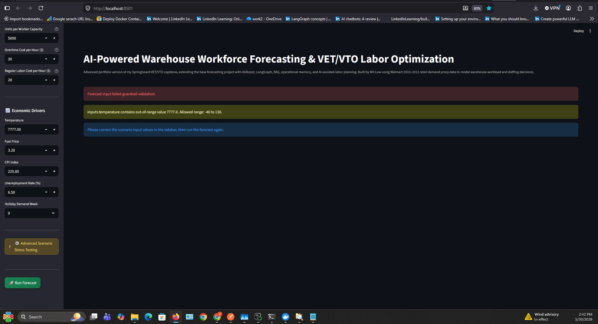
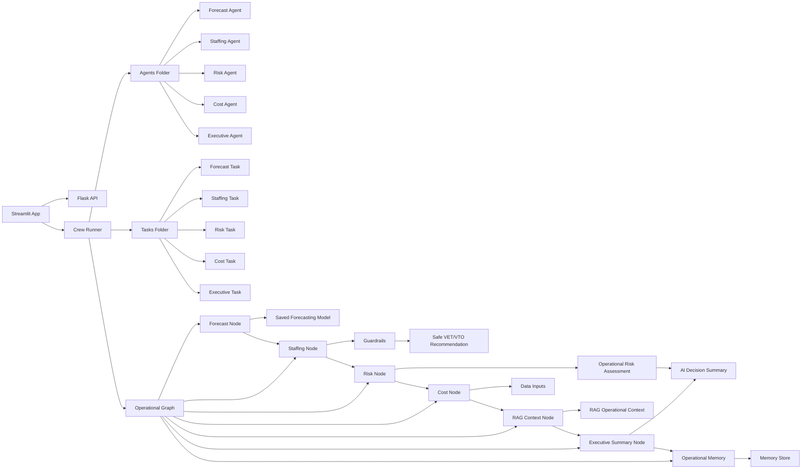

# Agentic VET/VTO Workforce Forecasting

### Multi-agent AI decision-support system for warehouse workforce forecasting, VET/VTO staffing recommendations, guardrails, and operational labor planning.

---

## Overview

This project is an advanced agentic AI version of a warehouse workforce forecasting and VET/VTO labor planning application.

The system combines machine learning forecasting, rule-based operational logic, multi-agent reasoning, guardrails, and business-friendly AI explanations to support workforce planning decisions in a warehouse operations environment.

The original base project focused on forecasting workload and generating VET/VTO/Normal staffing signals. This advanced version extends that idea into an agentic AI decision-support system, where multiple agents analyze forecast results, interpret staffing risk, estimate labor cost impact, and produce executive-level explanations.

---

## Business Problem

Warehouse operations teams must often make staffing decisions under uncertainty.

Common labor planning challenges include:

* Unexpected demand spikes
* Overstaffing and unnecessary labor cost
* Understaffing and operational backlog risk
* Reactive VET/VTO decisions
* Limited explanation behind staffing recommendations
* Difficulty translating forecast output into business action

This project addresses those challenges by using AI-assisted forecasting and agentic reasoning to support more informed staffing decisions.

---

## Project Goal

The goal of this project is to demonstrate how machine learning and agentic AI can be combined to support warehouse labor planning.

The system is designed to:

* Forecast future workload
* Generate VET, VTO, or Normal staffing recommendations
* Apply operational guardrails
* Estimate labor cost impact
* Explain staffing decisions in business language
* Provide an AI-assisted decision-support layer for operations leaders

---
## Base Project vs Advanced Version

This repository is the advanced agentic AI extension of the original VET/VTO workforce forecasting project.

The base version focused on machine learning forecasting, dashboarding, deployment, and labor cost analysis.

This advanced version adds:

- Multi-agent reasoning
- CrewAI-style agent/task structure
- LangGraph-style operational workflow
- Guardrail-based decision checks
- RAG-style operational context
- Executive-level AI summaries
- Scenario stress testing

The purpose of this repository is to demonstrate how a traditional forecasting application can evolve into an AI-assisted operations decision-support system.

### Related Links

- Portfolio page for the original base project: https://draculess99.github.io/VET-VTO-Forecasting/
- Original base GitHub repository: https://github.com/draculess99/VET-VTO-Forecasting
- Advanced agentic AI repository: https://github.com/draculess99/Agentic-VET-VTO-Workforce-Forecasting

---

## Screenshots

### 1. Advanced Scenario Forecast Dashboard



This screenshot shows the advanced weekly scenario mode, where operational drivers such as demand velocity, shipping delay, congestion, logistics stress, labor cost, and economic variables are used to generate forecast output, VET/VTO staffing signals, estimated labor cost impact, confidence scoring, and primary risk-driver identification.

### 2. AI Operational Decision Summary



This screenshot shows the application generating a business-facing operational summary using forecast output, staffing logic, risk assessment, estimated labor cost impact, RAG context, and operational memory.

### 3. Node Workflow State Trace



This screenshot shows the node workflow state trace used to inspect how the application passes operational data through the forecasting pipeline. It displays the current forecast state, forecast node output, staffing node output, cost node output, and intermediate decision fields such as peak week, stress band, confidence score, primary risk driver, VET weeks, and VTO weeks.

### 4. RAG Context Node Output



This screenshot shows the RAG Context Node retrieving operational reference material, scenario signals, cost assumptions, VET/VTO policy notes, forecasting methodology, and project limitations to support the final AI operational decision summary.

### 5. Guardrail Validation Example



The application rejects unrealistic scenario inputs before running the forecast, demonstrating that the system includes validation checks before allowing forecast execution.

```

## Model and Data

The forecasting layer uses historical workload and demand-related data to generate future workload estimates.

The project includes:

- Historical training data
- Store and feature data
- Saved model artifact
- Scenario templates for stress testing
- Cost and staffing assumptions

The saved model is stored in the `models/` directory and is used by the application to generate forecast-driven labor planning recommendations.

---

## Agentic AI Architecture

This project uses a multi-agent structure inspired by CrewAI and LangGraph-style workflow orchestration.

The agentic layer separates the decision process into specialized roles:

### Forecast Agent

Analyzes workload forecasts and identifies future demand patterns.

### Staffing Agent

Interprets forecast output and converts it into staffing recommendations such as VET, VTO, or Normal staffing.

### Cost Agent

Evaluates labor cost impact using regular labor cost, overtime cost, and staffing assumptions.

### Executive Agent

Summarizes the forecast, staffing recommendation, risk level, and business impact in plain English.

### Guardrail Layer

Checks whether staffing recommendations are operationally reasonable and avoids unrealistic or unsafe recommendations.

```

---

## System Architecture


---

## Workflow Logic

The system follows a structured decision flow:

```text

Input Data
   ↓
Forecasting Model
   ↓
Operational Graph
   ↓
Forecast Node
   ↓
Staffing Node
   ↓
Risk Node
   ↓
Cost Node
   ↓
Executive Summary Node
   ↓
Guardrail Review
   ↓
AI Operational Decision Summary
```

This structure allows the system to move beyond a basic dashboard and act more like an AI-assisted operations planning prototype.

---

## Key Features

* Machine learning-based workload forecasting
* VET/VTO/Normal staffing signal generation
* Multi-agent AI decision workflow
* LangGraph-style operational graph structure
* CrewAI-style agent and task separation
* Guardrails for safer staffing recommendations
* RAG-style operational context folder
* Memory layer for storing planning context
* Streamlit user interface
* Flask API support
* Scenario stress testing
* Labor cost impact estimation
* Executive-level AI decision summaries

---

## Technology Stack

* Python
* Streamlit
* Flask
* XGBoost / Machine Learning Forecasting
* CrewAI-style agent structure
* LangGraph-style workflow logic
* Pandas
* Scikit-learn
* Joblib
* Guardrails
* RAG-style document structure
* GitHub

---

## Repository Structure

```text
Agentic-VET-VTO-Workforce-Forecasting/
│
├── streamlit_app.py              # Main Streamlit application
├── flask_api.py                  # Flask API backend
├── crew_runner.py                # Runs the multi-agent workflow
├── requirements.txt              # Python dependencies
├── scenario_templates.tsv        # Scenario planning templates
│
├── agents/                       # AI agent definitions
│   ├── forecast_agent.py
│   ├── crew.py
│   ├── risk_agent.py
│   ├── staffing_agent.py
│   ├── cost_agent.py
│   └── executive_agent.py
│
├── tasks/                        # Agent task definitions
│   ├── forecast_task.py
│   ├── staffing_task.py
│   ├── cost_task.py
│   ├── risk_task.py
│   └── executive_task.py
│
├── graph/                        # Operational workflow graph
│   ├── operational_graph.py
│   ├── operational_state.py
│   └── graph_runner.py
│
├── nodes/                        # Workflow node logic
│   ├── forecast_node.py
│   ├── risk_node.py
│   ├── staffing_node.py
│   ├── cost_node.py
│   ├── rag_node.py
│   └── executive_node.py
│
├── guardrails/                   # Decision safety checks
│   └── guardrails.py
│
├── memory/                       # Memory/context management
│   ├── memory_store.json
│   └── memory_manager.py
│
├── rag_docs/                     # Operational reference documents
│   ├── cost_model_assumptions.txt
│   ├── forecasting_methodology.txt
│   ├── project_limitations.txt
│   ├── vet_vto_policy_notes.txt
│   └── warehouse_operations_notes.txt
│
├── tools/                        # Helper utilities used by agents, nodes, and workflow logic
│
├── data/                         # Forecasting data
│   ├── features.csv
│   ├── stores.csv
│   ├── test.csv
│   └── train.csv
│
├── models/                       # Saved model artifacts
│   └── warehouse_system.pkl
│
├── docs/                         # Documentation
│
├── images/                       # Screenshots and visuals
│   ├── guardrail-validation-screenshot.png
│   ├── advanced-scenario-forecast-dashboard.png
│   ├── ai-operational-decision-summary.png
│   ├── node-workflow-state-trace.png
│   └── rag-context-node-output.png
│
└── test/                         # Test scripts
    └── test_operational_graph.py
```

---

## How to Run Locally

### 1. Clone the repository

```bash
git clone https://github.com/draculess99/Agentic-VET-VTO-Workforce-Forecasting.git
cd Agentic-VET-VTO-Workforce-Forecasting
```

### 2. Create and activate a virtual environment

```bash
python -m venv .venv
```

On Windows:

```bash
.venv\Scripts\activate
```

On Mac/Linux:

```bash
source .venv/bin/activate
```

### 3. Install dependencies

```bash
pip install -r requirements.txt
```

### 4. Add environment variables

Create a `.env` file locally.

Example:

```env
OPENAI_API_KEY=your_openai_key_here
GROK_API_KEY=your_grok_key_here
GEMINI_API_KEY=your_gemini_key_here
```

Do not commit real API keys to GitHub.

---

## Run the Streamlit App

```bash
streamlit run streamlit_app.py
```

---

## Run the Flask API

```bash
python flask_api.py
```

---

## Run the Agentic Workflow

```bash
python crew_runner.py
```

To test the operational graph module:

```bash
python -m graph.graph_runner
```

---

## Example Use Case

A warehouse operations manager wants to know whether the upcoming workload requires additional labor coverage.

The system can:

1. Forecast expected workload
2. Identify peak demand periods
3. Recommend whether VET, VTO, or Normal staffing is appropriate
4. Estimate labor cost impact
5. Explain the recommendation in business language
6. Apply guardrails to avoid unsafe or unrealistic staffing decisions

---

## Guardrails

The guardrail layer is designed to ensure the system does not blindly produce staffing recommendations without operational checks.

Examples of guardrail logic include:

* Avoiding aggressive VTO recommendations during high-demand weeks
* Flagging peak demand periods
* Identifying potential staffing risk
* Preventing unrealistic labor planning assumptions
* Reminding users that AI output is decision support, not a replacement for human judgment

---

## Limitations

This project is a prototype and is not intended for production workforce scheduling without further validation.

Current limitations include:

- Forecast results depend on available historical data
- Staffing recommendations are simplified for portfolio demonstration purposes
- Labor rules and site-specific workforce policies are not fully modeled
- RAG documents are structured as local operational context rather than a production vector database
- Human review is required before applying any staffing recommendation

---

## AI Decision-Support Disclaimer

This application is a decision-support prototype.

It does not replace human operations judgment, workforce management policies, labor rules, or business leadership review. The AI-generated recommendations should be interpreted as planning support and reviewed by qualified operations personnel before use in real staffing decisions.

---

## Why This Project Matters

This project demonstrates how traditional forecasting applications can evolve into AI-assisted operational decision systems.

Instead of only showing a forecast chart, the system attempts to answer the more useful business question:

This project demonstrates how warehouse workload forecasting can be extended into an agentic AI system that reasons about staffing decisions, cost impact, operational risk, and executive communication.

> “What should operations do with this forecast?”

By combining forecasting, agents, guardrails, and executive summaries, this project shows how AI can help translate predictive analytics into practical workforce planning decisions.

---

## Future Improvements

Potential future enhancements include:

* Add live database integration
* Add stronger backtesting dashboards
* Add model comparison between XGBoost, baseline, and time-series models
* Add richer RAG retrieval from operational policy documents
* Add user authentication
* Add cloud deployment
* Add automated monitoring
* Add hospital staffing or healthcare workforce forecasting extension
* Add improved explainability with SHAP or feature importance
* Add scenario comparison across multiple labor planning strategies

---

## Author

Developed by **Wil Low / draculess99**

This project was developed as part of a broader data analytics, machine learning, and AI portfolio focused on workforce forecasting, operations optimization, and agentic AI decision-support systems.

GitHub: `https://github.com/draculess99`

---

## Project Status

Advanced prototype completed and published as a portfolio project.

This repository represents the agentic AI extension of the original VET/VTO workforce forecasting project.

